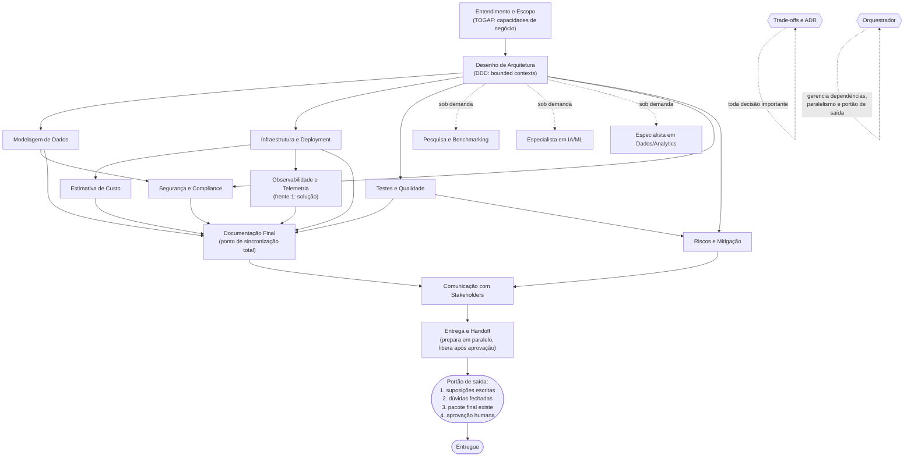

# Time de Agentes: Arquiteto de Soluções Júnior

Um conjunto de agentes de IA, construído sobre o [Claude Code](https://claude.com/claude-code), que atua como um time de Arquiteto de Soluções Júnior. Cada atividade real do trabalho de arquitetura (do entendimento da demanda até a entrega final) é um agente próprio, com uma skill focada só naquele objetivo, para reduzir alucinação e invenção fora de escopo. Os agentes rodam em loop: quando um tem dúvida sobre algo fora da própria atividade, pergunta ao agente dono dela em vez de adivinhar.

> **Status do projeto:** as 16 atividades + o orquestrador estão totalmente especificados e registrados como skill/subagentes nativos do Claude Code (`/arquiteto-solucoes`). Uma primeira demanda real já rodou ponta a ponta, mas ainda simulada manualmente, não pelo mecanismo de despacho por subagente. Trate isto como um design maduro, registrado, mas ainda não validado nesse formato de execução. Veja [Estado atual](#estado-atual) para o que falta.

---

## Sumário

- [Por que isto existe](#por-que-isto-existe)
- [Como funciona](#como-funciona)
- [Arquitetura do fluxo](#arquitetura-do-fluxo)
- [Duas camadas: execução vs referência](#duas-camadas-execução-vs-referência)
- [Estrutura do repositório](#estrutura-do-repositório-camada-de-referência)
  - [Onde ficam os outputs de uma demanda](#onde-ficam-os-outputs-de-uma-demanda)
- [Os 16 agentes](#os-16-agentes)
- [Regras e governança](#regras-e-governança)
- [Pré-requisitos](#pré-requisitos)
- [Como usar](#como-usar)
- [Estado atual](#estado-atual)
- [Como estender (adicionar um agente novo)](#como-estender-adicionar-um-agente-novo)
- [Licença](#licença)

---

## Por que isto existe

Arquitetura de solução tem muitas atividades distintas (entender a demanda, desenhar componentes, modelar dados, avaliar segurança, estimar custo, etc.), e é comum uma única pessoa (ou um único prompt genérico de IA) tentar fazer todas ao mesmo tempo. Isso convida a dois problemas: **alucinação** (inventar decisão técnica sem base) e **desvio de escopo** (uma atividade contaminando o julgamento de outra).

Este projeto resolve isso dividindo o trabalho em 16 atividades, cada uma com:
- Uma **skill** (`SKILL.md`): quando usar, os passos, o artefato de saída, e o critério de "isso está bem feito".
- Um **agente** (`AGENT.md`): o dono daquela atividade, quando ele é acionado, de quem ele depende, e o portão de revisão antes de passar o trabalho adiante.

Um **Orquestrador** decide a ordem, dispara em paralelo o que não depende de nada, e segura um portão de saída (com aprovação humana obrigatória) antes de qualquer pacote de arquitetura sair como "entregue".

## Como funciona

O projeto segue a metodologia **OS Agêntico**, seis camadas construídas de baixo para cima:

| # | Camada | Onde mora | O que é |
|---|---|---|---|
| 1 | Identidade | [`CLAUDE.md`](CLAUDE.md) | Quem é este time, a quem serve, o que sempre/nunca faz |
| 2 | Substrato | [`substrate/`](substrate/) | O conhecimento destilado (stack aprovada, padrões da casa, ADRs) que os agentes leem antes de decidir |
| 3 | Regras & Hooks | [`rules/`](rules/) | As paradas duras (`never.md`) e os reflexos automáticos (`always.md`) |
| 4 | Skills | [`skills/`](skills/) | Os 16 verbos conquistados, um por atividade |
| 5 | Ferramentas | [`tools.md`](tools.md) | Conexões somente-leitura a fontes externas (hoje, nenhuma ligada) |
| 6 | Agentes | [`agents/`](agents/) | Os papéis com julgamento que orquestram as skills |

Tudo o que os agentes decidem, aprendem ou ainda não sabem fica registrado em [`memory.md`](memory.md), a memória viva do OS. Rodar `audit` sobre essa metodologia produz um relatório específico em [`OS-AUDIT.md`](OS-AUDIT.md).

## Arquitetura do fluxo



- **Linhas sólidas** = dependência real (espera terminar).
- **Linhas pontilhadas** = acionado sob demanda, não roda por padrão.
- Até **4 ramos simultâneos** a partir do Desenho de Arquitetura, isso é o que economiza tempo e tokens.
- **Documentação Final** é o único ponto de sincronização total: espera todos os ramos técnicos terminarem antes de começar.

## Duas camadas: execução vs referência

Este repositório é a raiz de um projeto Claude Code. Isso cria duas camadas lado a lado, que não devem ser confundidas:

```
.
├── .claude/
│   ├── agents/                      # CAMADA DE EXECUÇÃO: 16 subagentes reais (front-matter, invocáveis)
│   │   ├── entendimento-e-escopo.md
│   │   └── ...
│   └── skills/
│       └── arquiteto-solucoes/SKILL.md  # CAMADA DE EXECUÇÃO: ponto de entrada, /arquiteto-solucoes
├── agents/<atividade>/AGENT.md      # CAMADA DE REFERÊNCIA: o subagente lê isto antes de agir
├── skills/<atividade>/SKILL.md      # CAMADA DE REFERÊNCIA: passos, artefato, critério de pronto
└── (CLAUDE.md, memory.md, demandas/, adrs/, rules/, substrate/, ...)
```

Os arquivos de execução são enxutos de propósito, eles apontam para os de referência em vez de duplicar o conteúdo. `.claude/` guarda só o que o Claude Code precisa descobrir de fato (subagentes e a skill de entrada); todo o resto — inclusive a documentação de referência de cada atividade — vive na raiz, fora de `.claude/`, porque subagentes despachados via Task resolvem caminho relativo contra a raiz real do projeto, não contra `.claude/`.

## Estrutura do repositório (camada de referência)

```
.
├── CLAUDE.md              # Identidade do OS (camada 1)
├── memory.md              # Memória viva: decisões, status, perguntas em aberto
├── OS-AUDIT.md            # Última auditoria completa das seis camadas
├── tools.md               # Conexões externas (camada 5), hoje somente leitura e nenhuma ligada
├── telemetria-agentes.md  # Registro contínuo de tempo/tokens gastos, entre demandas (ainda vazio)
├── adrs/                  # Architecture Decision Records formais, aprovados, globais (reaproveitáveis por qualquer demanda)
├── demandas/
│   └── <nome-da-demanda>/ # Uma pasta por demanda real, criada pelo agente de Entendimento e Escopo
│       ├── entendimento.md
│       ├── desenho.md
│       └── ...            # um arquivo por atividade que rodou nesta demanda, ver tabela abaixo
├── rules/
│   ├── always.md          # O que todo agente sempre faz + hooks
│   └── never.md           # Paradas duras
├── substrate/
│   ├── compendium.md      # A referência destilada que os agentes leem antes de decidir
│   └── sources.md         # De onde esse conhecimento vem
├── skills/
│   ├── roadmap.md         # As 16 atividades, o que já foi conquistado
│   └── <atividade>/SKILL.md
└── agents/
    ├── roadmap.md         # Espelha skills/roadmap.md
    ├── orquestrador/AGENT.md
    └── <atividade>/AGENT.md
```

Cada atividade tem a mesma pasta em `skills/` e `agents/` (mesmo nome), para ser fácil de achar as duas metades de uma atividade.

### Onde ficam os outputs de uma demanda

O nome da demanda **nunca é inventado por um agente**. Quem pede a demanda informa o nome explicitamente ao agente de Entendimento e Escopo (ou o agente pergunta e espera a resposta, se ninguém deu um nome ainda). Esse nome, exatamente como dado, vira a pasta `demandas/<nome-da-demanda>/`, e cada atividade que rodar nessa demanda grava um arquivo lá dentro (`entendimento.md`, `desenho.md`, `dados.md`, etc.), em vez de espalhar arquivos soltos na raiz. Duas exceções ficam fora de `demandas/`: `adrs/` (decisões reaproveitáveis por demandas futuras) e `telemetria-agentes.md` (registro contínuo entre demandas).

> `demandas/` está em `.gitignore` e não faz parte deste repositório público: sempre que uma demanda roda, os artefatos ficam só no seu clone local. As demandas usadas para validar a cadeia de agentes ponta a ponta durante o desenvolvimento deste OS foram todas sintéticas (nomes de empresa, SDRs, orçamentos e decisões fictícios, nenhuma descrevendo um cliente real), e por isso mesmo não foram publicadas — mantenha o mesmo cuidado com as suas.

## Os 16 agentes

| # | Agente | Quando entra | Depende de / é acionado por |
|---|---|---|---|
| 1 | [Entendimento e Escopo](agents/entendimento-e-escopo/AGENT.md) | Sempre, primeiro | A demanda crua |
| 2 | [Desenho de Arquitetura](agents/desenho-de-arquitetura/AGENT.md) | Sempre, segundo | Entendimento e Escopo |
| 3 | [Pesquisa e Benchmarking](agents/pesquisa-e-benchmarking/AGENT.md) | Sob demanda | Quando a stack aprovada não resolve |
| 4 | [Trade-offs e ADR](agents/trade-offs-e-adr/AGENT.md) | Toda decisão importante | Tem portão de aprovação humana próprio |
| 5 | [Modelagem de Dados](agents/modelagem-de-dados/AGENT.md) | Paralelo, a partir do Desenho | Desenho de Arquitetura |
| 6 | [Segurança e Compliance](agents/seguranca-e-compliance/AGENT.md) | Depois de Desenho + Modelagem | Não roda em paralelo com eles |
| 7 | [Infraestrutura e Deployment](agents/infraestrutura-e-deployment/AGENT.md) | Paralelo, a partir do Desenho | Desenho de Arquitetura |
| 8 | [Estimativa de Custo](agents/estimativa-de-custo/AGENT.md) | Depois de Infraestrutura | Não roda em paralelo com ele |
| 9 | [Observabilidade e Telemetria](agents/observabilidade-e-telemetria/AGENT.md) | Frente 1 depois de Infra; frente 2 contínua | Duas frentes: solução entregue + telemetria dos agentes |
| 10 | [Testes e Qualidade](agents/testes-e-qualidade/AGENT.md) | Paralelo, a partir do Desenho | Desenho de Arquitetura |
| 11 | [Documentação Final](agents/documentacao-final/AGENT.md) | Sincronização total | Espera todos os ramos técnicos |
| 12 | [Riscos e Mitigação](agents/riscos-e-mitigacao/AGENT.md) | Paralelo com Documentação Final | Desenho + Testes e Qualidade |
| 13 | [Comunicação com Stakeholders](agents/comunicacao-stakeholders/AGENT.md) | Depois de Doc. Final + Riscos | Traduz o que já existe, não decide nada novo |
| 14 | [Entrega e Handoff](agents/entrega-e-handoff/AGENT.md) | Última | Prepara em paralelo, libera após aprovação |
| 15 | [Especialista em Dados e Analytics](agents/especialista-dados-analytics/AGENT.md) | Sob demanda | Só se há decisão de plataforma analítica |
| 16 | [Especialista em IA e Machine Learning](agents/especialista-ia-ml/AGENT.md) | Sob demanda | Só se há decisão de modelo de IA/ML |
| — | [Orquestrador](agents/orquestrador/AGENT.md) | Sempre ativo | Gerencia dependências, paralelismo e o portão de saída |

## Regras e governança

- **Nunca** ([`rules/never.md`](rules/never.md)): um agente decide fora do próprio escopo; uma dúvida entre agentes passa de 3 rodadas sem se resolver (na 4ª, escala para revisão humana); uma entrega sai sem suposições/trade-offs escritos; um agente reaproveita contexto de uma demanda anterior.
- **Sempre** ([`rules/always.md`](rules/always.md)): expor suposições e trade-offs; perguntar ao dono da atividade em caso de dúvida; paralelizar quando possível; registrar tempo/tokens gastos.
- **Decisões importantes viram ADR** ([`adrs/`](adrs/)), formalizadas pelo agente [Trade-offs e ADR](agents/trade-offs-e-adr/AGENT.md), com portão de aprovação humana obrigatório (pessoa sênior ou líder técnico) antes de valer como decisão oficial.
- **Cloud é agnóstica de provedor** ([ADR 001](adrs/adr-001-cloud-agnostica-por-criterio-de-negocio.md)): a escolha é por critério de negócio a cada demanda, não fixada em um provedor.
- **Microsserviços seguem os limites de domínio** ([ADR 002](adrs/adr-002-microsservicos-como-consequencia-de-ddd.md)): o time usa TOGAF (Business Architecture) para mapear capacidades de negócio e DDD (Domain-Driven Design) para traduzir isso em bounded contexts.

## Pré-requisitos

- [Claude Code](https://claude.com/claude-code) instalado.
- Nenhuma dependência externa, chave de API ou etapa de build. `tools.md` documenta conexões futuras opcionais (repositório de docs, backlog, observabilidade), todas ainda desligadas.

## Como usar

Este projeto é registrado no padrão nativo do Claude Code, em duas camadas:

- **`.claude/skills/arquiteto-solucoes/SKILL.md`**: o ponto de entrada. Uma skill de verdade (com front-matter `name`/`description`/`allowed-tools`), invocável com `/arquiteto-solucoes`.
- **`.claude/agents/*.md`**: os 16 subagentes reais, um por atividade, cada um com seu próprio front-matter (`name`, `description`, `tools`), invocáveis individualmente pela ferramenta de Agent/Task do Claude Code. A skill de entrada os despacha na ordem certa, paralelizando o que pode ser paralelo.

Os arquivos em `agents/<atividade>/AGENT.md` e `skills/<atividade>/SKILL.md` (sem o prefixo `.claude/`) continuam existindo, são a documentação de referência completa que cada subagente lê antes de agir (papel, passos, critério de pronto, portão de revisão). O subagente registrado é a versão enxuta que aciona essa referência, não uma duplicata.

1. Clone o repositório (ou copie a pasta inteira) para a raiz do projeto onde você quer usar o time de agentes — este repositório já É essa raiz, não deve ser aninhado dentro do `.claude/` de outro projeto.
2. Rode `/arquiteto-solucoes <pedido ou SDR colado>` no Claude Code, dentro dessa pasta.
3. **Dê um nome explícito à demanda quando for pedido.** Esse nome nunca é inventado por um agente, vira a pasta `demandas/<nome-da-demanda>/` onde tudo desta demanda é gravado (veja [Onde ficam os outputs de uma demanda](#onde-ficam-os-outputs-de-uma-demanda)).
4. A skill de entrada despacha os subagentes na ordem e no paralelismo do [fluxo](#arquitetura-do-fluxo), até o portão de saída (com aprovação humana obrigatória) e a liberação em `demandas/<nome-da-demanda>/handoff.md`.
5. Rode `/arquiteto-solucoes status <nome-da-demanda>` a qualquer momento para ver o que já rodou e o que falta, sem despachar nada.

## Estado atual

Veja [`OS-AUDIT.md`](OS-AUDIT.md) para a auditoria completa. Resumo honesto:

- As seis camadas do OS estão `solid`, o roteiro de 16 atividades está fechado, dois ADRs estão formalmente aprovados, e uma primeira demanda real já rodou ponta a ponta (`demandas/sdr-2026-001-portal-digital-de-sinistros-e-upload-de-fotos/`), embora nessa rodada os agentes ainda tenham sido simulados manualmente, não despachados pelo mecanismo abaixo.
- **Os 16 subagentes e a skill de entrada foram registrados** em `.claude/agents/` e `.claude/skills/arquiteto-solucoes/`, seguindo o padrão nativo do Claude Code. Ainda não foram testados invocando `/arquiteto-solucoes` de ponta a ponta neste formato, só verificados estruturalmente (front-matter, caminho de descoberta).
- **Os dois especialistas sob demanda (Dados/Analytics e IA/ML) nunca foram acionados de verdade.** O critério de gatilho deles ainda não foi testado.
- `tools.md` lista três conexões externas úteis, nenhuma está ligada ainda.
- Custo de processamento por agente (tokens/tempo reais, não estimados) ainda depende de rodar via essa execução por subagente de verdade, ver `telemetria-agentes.md` e `demandas/<nome-da-demanda>/custo-processamento.md`.

## Como estender (adicionar um agente novo)

Siga sempre esta ordem, para não repetir o anti-padrão de "agente faz-tudo" nem inventar trabalho que ninguém pediu:

1. Confirme que é uma atividade real e repetida, não uma ideia especulativa.
2. Escreva a `SKILL.md` primeiro: quando usar, passos, artefato de saída, critério de "bem feito". Se a atividade só se aplica em certas condições, escreva o critério de gatilho explicitamente (veja os dois especialistas sob demanda como exemplo).
3. Só depois escreva o `AGENT.md`: o papel, quando é acionado, de quem depende, o portão de revisão, e a fronteira clara com agentes que já existem (para não sobrepor responsabilidade).
4. Atualize `agents/roadmap.md`, `skills/roadmap.md` e o papel do novo agente em `agents/orquestrador/AGENT.md`.
5. Registre a decisão em `memory.md`.

## Licença

[MIT](LICENSE). Uso, cópia, modificação e distribuição livres, sem garantia, mantendo o aviso de copyright.
