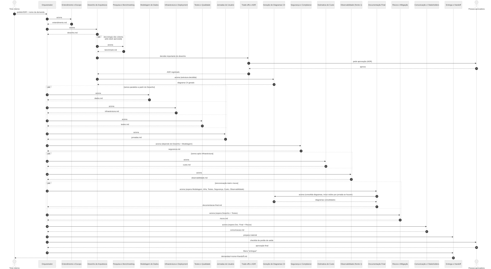

# solutions-architecture-jr-agents

Um time de agentes de IA — construído sobre o [Claude Code](https://claude.com/claude-code) — que atua como um **Arquiteto de Soluções Júnior**. Em vez de um prompt genérico tentando fazer tudo de uma vez, cada atividade real do trabalho de arquitetura vira um agente próprio, com escopo estreito, uma skill dedicada e um critério claro de "isso está bem feito".

> **Status do projeto:** as 18 atividades + o Orquestrador estão especificadas e registradas como skill/subagentes nativos do Claude Code (`/arquiteto-solucoes`). Quatro demandas já rodaram ponta a ponta via despacho real de subagente. Os dois agentes mais novos (Geração de Diagramas C4 e Jornadas do Usuário) ainda não passaram por essa validação end-to-end — veja [Estado atual](#estado-atual).

---

## Sumário

### Conceitos

- [Por que isto existe](#por-que-isto-existe)
- [Ideia central em 30 segundos](#ideia-central-em-30-segundos)
- [Glossário rápido](#glossário-rápido)
- [Arquitetura da workspace](#arquitetura-da-workspace)
  - [As seis camadas do OS](#1-as-seis-camadas-do-os)
  - [Fluxo de execução, numerado e em estilo C4](#2-fluxo-de-execução-numerado-e-em-estilo-c4)
  - [Diagrama de sequência completo](#3-diagrama-de-sequência-completo)
  - [Execução vs. referência no disco](#4-execução-vs-referência-no-disco)

### Mão na massa

- [Pré-requisitos](#pré-requisitos)
- [Quickstart](#quickstart)
- [Onde ficam os outputs de uma demanda](#onde-ficam-os-outputs-de-uma-demanda)
- [Os 18 agentes](#os-18-agentes)
- [Regras e governança](#regras-e-governança)
- [Estado atual](#estado-atual)
- [Como estender (adicionar um agente novo)](#como-estender-adicionar-um-agente-novo)
- [Licença](#licença)

---

## Por que isto existe

Arquitetura de solução tem muitas atividades distintas — entender a demanda, desenhar componentes, modelar dados, avaliar segurança, estimar custo — e é comum uma única pessoa (ou um único prompt genérico de IA) tentar fazer todas ao mesmo tempo. Isso convida dois problemas:

- **Alucinação**: inventar uma decisão técnica sem base.
- **Desvio de escopo**: uma atividade contaminando o julgamento de outra (ex: quem está pensando em custo já começa a decidir segurança).

Este projeto resolve isso dividindo o trabalho em **18 atividades**, cada uma com um dono (agente) e uma skill focada só naquele objetivo. Um **Orquestrador** decide a ordem, dispara em paralelo o que não depende de nada, e segura um portão de saída — com aprovação humana obrigatória — antes de qualquer pacote de arquitetura sair como "entregue".

## Ideia central em 30 segundos

```text
Demanda crua (SDR, pedido de negócio)
        │
        ▼
  18 agentes especialistas, cada um dono de UMA atividade,
  perguntando uns aos outros quando têm dúvida fora do próprio escopo
        │
        ▼
  Pacote de arquitetura completo: entendimento, desenho, dados,
  segurança, custo, observabilidade, riscos, ADRs — com suposições
  e trade-offs escritos em cada decisão
        │
        ▼
  Portão de saída (aprovação humana obrigatória) → Entregue
```

Se você já usou um time real de arquitetura, a analogia é direta: em vez de um arquiteto sênior sozinho tentando cobrir todas as frentes, você tem uma pessoa júnior por atividade, cada uma boa numa coisa só, que sabe pedir ajuda para o colega certo em vez de chutar.

## Glossário rápido

| Termo | O que é |
| --- | --- |
| **Agente** | Dono de uma atividade específica (ex: Modelagem de Dados). Decide só dentro do próprio escopo. |
| **Skill** | O "manual de operação" de uma atividade: quando usar, passos, artefato de saída, critério de pronto. |
| **Orquestrador** | Gerencia a ordem, o paralelismo e o portão de saída. Não desenha nem decide nada de arquitetura sozinho. |
| **Demanda** | Um pedido de arquitetura específico, com nome próprio, nunca inventado pelo agente. Vira uma pasta em `demandas/`. |
| **ADR** | Architecture Decision Record. Toda decisão importante vira um ADR formal, com aprovação humana antes de valer. |
| **Portão de saída** | Checklist obrigatório (suposições escritas, dúvidas fechadas, pacote completo, aprovação humana) antes de "entregue". |
| **Substrato** | O conhecimento destilado (stack aprovada, padrões da casa, ADRs anteriores) que os agentes leem antes de decidir. |

## Arquitetura da workspace

Esta seção documenta como a `solutions-architecture-jr-agents` está montada, em quatro vistas complementares: as camadas conceituais, o fluxo de execução numerado (estilo C4), o mesmo fluxo como troca de mensagens no tempo (sequência completa), e o mapeamento para o disco.

### 1. As seis camadas do OS

O projeto segue a metodologia **OS Agêntico**, construída de baixo para cima: cada camada depende da que veio antes.



*Fonte editável: [`docs/diagrams/01-camadas.mmd`](docs/diagrams/01-camadas.mmd)*

Tudo o que os agentes decidem, aprendem ou ainda não sabem fica registrado em [`memory.md`](memory.md), a memória viva do OS.

### 2. Fluxo de execução, numerado e em estilo C4

Mesma forma geométrica para o mesmo tipo de caixa — retângulo arredondado em todo lugar, cor indica o papel (sequencial, paralelo, sincronização, transversal), como num diagrama C4 de containers. Os números dentro de cada caixa são a ordem real de execução; letras (`3a`/`3b`/`3c`, `5a`/`5b`, `6a`/`6b`) marcam passos que acontecem **no mesmo estágio, em paralelo**.



*Fonte editável: [`docs/diagrams/02-fluxo.mmd`](docs/diagrams/02-fluxo.mmd)*

| Cor | Significa |
| --- | --- |
| 🟦 Azul escuro | Passo sequencial obrigatório (espera o anterior terminar) |
| 🟦 Azul claro | Ramo paralelo (não depende dos outros do mesmo estágio) |
| ⬜ Cinza tracejado | Sob demanda — só entra se o gatilho específico bater |
| 🟧 Laranja | Ponto de sincronização (espera **todos** os ramos que apontam para ele) |
| 🟥 Vermelho | Portão de saída (gate) |
| 🟩 Verde | Entregue (fim) |
| ⬜ Tracejado fino | Transversal — Trade-offs/ADR, Geração de Diagramas C4 e Orquestrador atuam o tempo todo, não são um passo numerado |

1. Entendimento e Escopo
2. Desenho de Arquitetura (aciona Geração de Diagramas C4 assim que a estrutura fecha)
3. Em paralelo — **3a** Modelagem de Dados · **3b** Infraestrutura e Deployment · **3c** Testes e Qualidade · **3d** Jornadas do Usuário (+ sob demanda: Pesquisa e Benchmarking, Especialista IA/ML, Especialista Dados/Analytics)
4. Segurança e Compliance (espera 2 + 3a)
5. Em paralelo, após 3b — **5a** Estimativa de Custo · **5b** Observabilidade e Telemetria (frente 1)
6. Em paralelo — **6a** Documentação Final (sincroniza 3a+3b+3c+3d+4+5a+5b, aciona Geração de Diagramas C4 de novo pra consolidar) · **6b** Riscos e Mitigação (espera 2 + 3c)
7. Comunicação com Stakeholders (espera 6a + 6b)
8. Entrega e Handoff prepara o material
9. Portão de saída (suposições, dúvidas fechadas, pacote completo, aprovação humana)
10. Entregue

### 3. Diagrama de sequência completo

O mesmo fluxo acima, mas como troca de mensagens no tempo — cada um dos 18 agentes aparece individualmente, com o Orquestrador e a Pessoa aprovadora nas pontas. A numeração é automática (`autonumber`), uma por mensagem trocada, então o número aqui é o da mensagem, não o do estágio da vista anterior.



*Fonte editável: [`docs/diagrams/04-sequencia.mmd`](docs/diagrams/04-sequencia.mmd)*

### 4. Execução vs. referência no disco

Este repositório é a raiz de um projeto Claude Code, o que cria duas camadas lado a lado que não devem ser confundidas: uma versão **enxuta e invocável** dentro de `.claude/`, e a **documentação de referência completa** que essa versão enxuta consulta antes de agir.



*Fonte editável: [`docs/diagrams/03-execucao-referencia.mmd`](docs/diagrams/03-execucao-referencia.mmd)*

Os arquivos de execução apontam para os de referência em vez de duplicar conteúdo. `.claude/` guarda só o que o Claude Code precisa descobrir (subagentes e a skill de entrada); o resto — inclusive a documentação completa de cada atividade — vive na raiz, fora de `.claude/`, porque subagentes despachados resolvem caminho relativo contra a raiz real do projeto, nunca contra `.claude/`. **Por isso todo despacho de subagente usa caminho absoluto** (reforçado por um hook real em `.claude/settings.json`, ver [Regras e governança](#regras-e-governança)).

```text
.
├── .claude/
│   ├── agents/*.md                       # execução: 18 subagentes reais
│   └── skills/arquiteto-solucoes/SKILL.md # execução: ponto de entrada
├── CLAUDE.md               # Identidade (camada 1)
├── memory.md               # Memória viva: decisões, status, perguntas em aberto
├── tools.md                # Conexões externas (camada 5), hoje nenhuma ligada
├── telemetria-agentes.md   # Registro contínuo de tempo/tokens gastos, entre demandas
├── adrs/                   # ADRs formais, aprovados, globais, reaproveitáveis
├── demandas/                # Uma pasta por demanda real (local, não versionado)
│   └── <nome-da-demanda>/
├── rules/
│   ├── always.md           # O que todo agente sempre faz + hooks
│   └── never.md            # Paradas duras
├── substrate/
│   ├── compendium.md       # Referência destilada que os agentes leem antes de decidir
│   └── sources.md          # De onde esse conhecimento vem
├── skills/<atividade>/SKILL.md   # referência: passos, artefato, critério de pronto
└── agents/<atividade>/AGENT.md   # referência: papel, dependências, portão de revisão
```

Cada atividade tem a mesma pasta em `skills/` e `agents/` (mesmo nome), para ser fácil achar as duas metades de uma atividade.

---

## Pré-requisitos

- [Claude Code](https://claude.com/claude-code) instalado.
- Nenhuma dependência externa, chave de API ou etapa de build. `tools.md` documenta conexões futuras opcionais (repositório de docs, backlog, observabilidade), todas ainda desligadas.

## Quickstart

**1. Coloque este repositório na raiz do seu projeto Claude Code.**
Este repositório já É a raiz — não o aninhe dentro do `.claude/` de outro projeto.

```bash
git clone <este-repositório>
cd solutions-architecture-jr-agents
claude   # sempre abra a CLI a partir daqui, não de uma subpasta
```

> Por que a partir da raiz? O Claude Code carrega `.claude/settings.json` a partir do diretório onde a sessão foi iniciada, não da raiz do git. Abrir de uma subpasta faz o hook de caminho absoluto (ver [Regras e governança](#regras-e-governança)) simplesmente não carregar, sem aviso de erro. Confira com `/hooks` que `PreToolUse` aparece listado.

**2. Dispare uma demanda nova.**

```text
/arquiteto-solucoes <cole aqui o pedido ou o SDR>
```

A primeira coisa que o time faz é confirmar o **nome da demanda** com você — esse nome nunca é inventado por um agente (ver [rules/never.md](rules/never.md)). É esse nome exato que vira a pasta `demandas/<nome-da-demanda>/`.

**3. Deixe o time trabalhar.**
A skill de entrada despacha os 18 agentes na ordem e no paralelismo do [fluxo](#2-fluxo-de-execução-numerado-e-em-estilo-c4), até o portão de saída — que inclui aprovação humana obrigatória — e a liberação final em `demandas/<nome-da-demanda>/handoff.md`.

**4. Acompanhe sem interromper, a qualquer momento.**

```text
/arquiteto-solucoes status <nome-da-demanda>
```

Mostra o que já rodou e o que falta, sem despachar nenhum agente novo.

**5. Quando o portão de saída pedir aprovação, revise e aprove.**
Nada sai como "entregue" sem uma pessoa do time confirmar — mesmo que todos os outros critérios do portão já tenham passado.

### Onde ficam os outputs de uma demanda

O nome da demanda **nunca é inventado por um agente**. Quem pede informa o nome explicitamente ao agente de Entendimento e Escopo (ou o agente pergunta e espera a resposta). Esse nome vira a pasta `demandas/<nome-da-demanda>/`, e cada atividade grava um arquivo lá (`entendimento.md`, `desenho.md`, `dados.md`, etc.), em vez de espalhar arquivos soltos na raiz. Duas exceções ficam fora de `demandas/`: `adrs/` (decisões reaproveitáveis por demandas futuras) e `telemetria-agentes.md` (registro contínuo entre demandas).

> `demandas/` está em `.gitignore`, não faz parte deste repositório público: os artefatos de cada demanda ficam só no seu clone local. As demandas usadas para validar a cadeia durante o desenvolvimento deste OS foram todas sintéticas (empresa, SDR, orçamento e decisões fictícios), e por isso não foram publicadas — mantenha o mesmo cuidado com as suas.

## Os 18 agentes

| # | Agente | Quando entra | Depende de / é acionado por |
| --- | --- | --- | --- |
| 1 | [Entendimento e Escopo](agents/entendimento-e-escopo/AGENT.md) | Sempre, primeiro | A demanda crua |
| 2 | [Desenho de Arquitetura](agents/desenho-de-arquitetura/AGENT.md) | Sempre, segundo | Entendimento e Escopo |
| 3 | [Pesquisa e Benchmarking](agents/pesquisa-e-benchmarking/AGENT.md) | Sob demanda | Quando a stack aprovada não resolve |
| 4 | [Trade-offs e ADR](agents/trade-offs-e-adr/AGENT.md) | Toda decisão importante | Tem portão de aprovação humana próprio |
| 5 | [Modelagem de Dados](agents/modelagem-de-dados/AGENT.md) | Paralelo, a partir do Desenho | Desenho de Arquitetura |
| 6 | [Segurança e Compliance](agents/seguranca-e-compliance/AGENT.md) | Depois de Desenho + Modelagem | Não roda em paralelo com eles |
| 7 | [Infraestrutura e Deployment](agents/infraestrutura-e-deployment/AGENT.md) | Paralelo, a partir do Desenho | Desenho de Arquitetura |
| 8 | [Estimativa de Custo](agents/estimativa-de-custo/AGENT.md) | Depois de Infraestrutura | Não roda em paralelo com ele |
| 9 | [Observabilidade e Telemetria](agents/observabilidade-e-telemetria/AGENT.md) | Frente 1 depois de Infra; frente 2 contínua | Duas frentes: solução entregue + telemetria dos agentes |
| 10 | [Testes e Qualidade](agents/testes-e-qualidade/AGENT.md) | Paralelo, a partir do Desenho | Desenho de Arquitetura |
| 11 | [Jornadas do Usuário](agents/jornadas-do-usuario/AGENT.md) | Paralelo, a partir do Desenho | Desenho de Arquitetura + RFs de Entendimento e Escopo |
| 12 | [Documentação Final](agents/documentacao-final/AGENT.md) | Sincronização total | Espera todos os ramos técnicos |
| 13 | [Riscos e Mitigação](agents/riscos-e-mitigacao/AGENT.md) | Paralelo com Documentação Final | Desenho + Testes e Qualidade |
| 14 | [Comunicação com Stakeholders](agents/comunicacao-stakeholders/AGENT.md) | Depois de Doc. Final + Riscos | Traduz o que já existe, não decide nada novo |
| 15 | [Entrega e Handoff](agents/entrega-e-handoff/AGENT.md) | Última | Prepara em paralelo, libera após aprovação |
| 16 | [Especialista em Dados e Analytics](agents/especialista-dados-analytics/AGENT.md) | Sob demanda | Só se há decisão de plataforma analítica |
| 17 | [Especialista em IA e Machine Learning](agents/especialista-ia-ml/AGENT.md) | Sob demanda | Só se há decisão de modelo de IA/ML |
| 18 | [Geração de Diagramas C4](agents/geracao-diagramas/AGENT.md) | Transversal | Acionado por Desenho de Arquitetura e Documentação Final |
| — | [Orquestrador](agents/orquestrador/AGENT.md) | Sempre ativo | Gerencia dependências, paralelismo e o portão de saída |

## Regras e governança

- **Nunca** ([`rules/never.md`](rules/never.md)): um agente decide fora do próprio escopo; uma dúvida entre agentes passa de 3 rodadas sem se resolver (na 4ª, escala para revisão humana); uma entrega sai sem suposições/trade-offs escritos; um agente reaproveita contexto de uma demanda anterior.
- **Sempre** ([`rules/always.md`](rules/always.md)): expor suposições e trade-offs; perguntar ao dono da atividade em caso de dúvida; paralelizar quando possível; registrar tempo/tokens gastos.
- **Hook real de caminho absoluto**: `.claude/settings.json` bloqueia (`PreToolUse`, `permissionDecision: deny`) qualquer despacho de subagente cujo prompt referencie `demandas/...` sem caminho absoluto. É reforço de verdade do harness, não só descrição de comportamento — só funciona se a sessão for aberta a partir da raiz do repo (ver [Quickstart](#quickstart)).
- **Decisões importantes viram ADR** ([`adrs/`](adrs/)), formalizadas pelo agente [Trade-offs e ADR](agents/trade-offs-e-adr/AGENT.md), com portão de aprovação humana obrigatório antes de valer como decisão oficial.
- **Cloud é agnóstica de provedor** ([ADR 001](adrs/adr-001-cloud-agnostica-por-criterio-de-negocio.md)): a escolha é por critério de negócio a cada demanda, não fixada em um provedor.
- **Microsserviços seguem os limites de domínio** ([ADR 002](adrs/adr-002-microsservicos-como-consequencia-de-ddd.md)): TOGAF (Business Architecture) mapeia capacidades de negócio, DDD traduz isso em bounded contexts.

## Estado atual

Veja [`memory.md`](memory.md) para o histórico completo de decisões. Resumo honesto:

- As seis camadas do OS estão sólidas, o roteiro de 18 atividades está fechado, quatro demandas reais já rodaram ponta a ponta via `/arquiteto-solucoes` de verdade (despacho por subagente, não simulação), com custo de processamento medido em tokens reais — ver `telemetria-agentes.md`.
- **Os subagentes e a skill de entrada estão registrados** em `.claude/agents/` e `.claude/skills/arquiteto-solucoes/`, seguindo o padrão nativo do Claude Code, e já foram exercitados de ponta a ponta em execuções reais.
- **Dois agentes novos (Geração de Diagramas C4 e Jornadas do Usuário) foram adicionados em 2026-08-15** (ver `memory.md`) para resolver diagramas ASCII dessincronizados entre `desenho.md`/`documentacao-final.md` e para dar um roteiro de sequência a partir dos requisitos. Ainda não rodaram numa demanda real de ponta a ponta — próximo passo real do projeto.
- **Dos dois especialistas sob demanda, só o de IA/ML já foi acionado de verdade** (`demandas/plataforma-ia-corporativa-v1/`, confirmando que o gatilho dispara quando deveria, depois de três demandas seguidas confirmando só o caminho de não disparar à toa). **O Especialista em Dados e Analytics nunca foi acionado** — nenhuma demanda real até agora teve decisão de plataforma analítica de verdade.
- `tools.md` lista três conexões externas úteis, nenhuma ligada ainda.
- ADRs 001 a 020 registrados em `adrs/`, com aprovação humana explícita registrada em cada um antes de valer como oficial.

## Como estender (adicionar um agente novo)

Siga sempre esta ordem, para não repetir o anti-padrão de "agente faz-tudo" nem inventar trabalho que ninguém pediu:

1. Confirme que é uma atividade real e repetida, não uma ideia especulativa.
2. Escreva a `SKILL.md` primeiro: quando usar, passos, artefato de saída, critério de "bem feito". Se a atividade só se aplica em certas condições, escreva o critério de gatilho explicitamente (veja os dois especialistas sob demanda como exemplo).
3. Só depois escreva o `AGENT.md`: o papel, quando é acionado, de quem depende, o portão de revisão, e a fronteira clara com agentes que já existem (para não sobrepor responsabilidade).
4. Atualize `agents/roadmap.md`, `skills/roadmap.md` e o papel do novo agente em `agents/orquestrador/AGENT.md`.
5. Registre a decisão em `memory.md`.

## Licença

[MIT](LICENSE). Uso, cópia, modificação e distribuição livres, sem garantia, mantendo o aviso de copyright.
